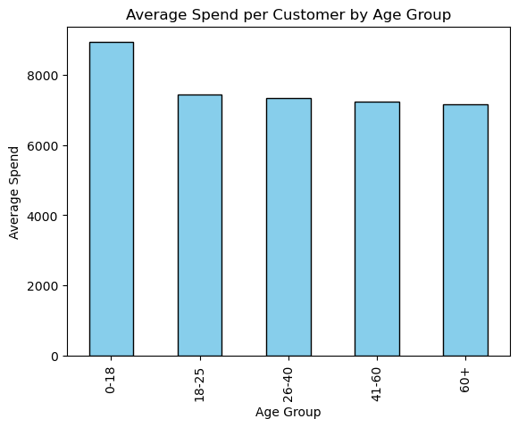
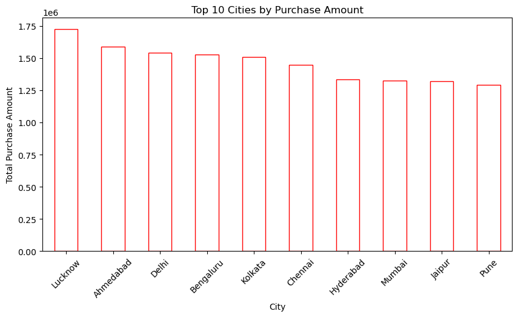
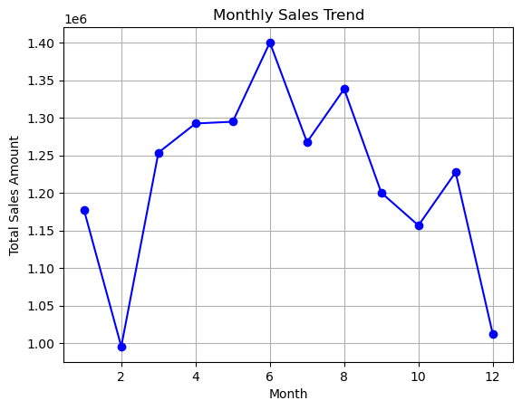

🛒 Retail Transactions Analysis – Data Cleaning & Visualization
📌 Project Overview

A retail chain operating across multiple cities in India is facing challenges in understanding customer preferences, seasonal demand, and city-level sales performance, especially after expanding into Tier-2 and Tier-3 cities.

This project focuses on:
✔ Cleaning and preprocessing messy transactional data
✔ Handling missing and inconsistent values
✔ Feature engineering for better insights
✔ Visualizing customer demographics and sales trends
✔ Preparing a business-ready dataset for decision-making

The dataset contains 10,000+ retail transaction records (sample of 2000 provided).

📂 Dataset Details

File: Retail_Transactions_2000.csv

Column	Description
TransactionID	Unique ID for each transaction
CustomerID	Unique ID for customers
Gender	Male/Female/Other
Age	Age of the customer
City	City where purchase happened
ProductCategory	Category of product purchased
Quantity	Units purchased
Price	Price per unit (₹)
TotalAmount	Derived column (Quantity × Price)
PurchaseDate	Date of purchase
PaymentMode	Cash, Card, UPI, Wallet
🛠️ Part A: Data Preprocessing
1. Data Inspection

Checked dataset size, structure, and column details

Identified missing values, duplicates, and inconsistencies

2. Handling Missing Data

Filled missing Age with median

Filled missing City with most frequent city

Dropped rows with missing critical fields (TransactionID, ProductCategory)

3. Data Cleaning

Removed duplicate transactions

Standardized categorical values (Male, MALE, m → Male)

Corrected invalid values (negative/zero Quantity or Price)

4. Feature Engineering

Derived TotalAmount where missing

Extracted Month and DayOfWeek from PurchaseDate

Created AgeGroup:

18–25, 26–40, 41–60, 60+

5. Encoding & Transformation

Encoded categorical variables (Gender, City, PaymentMode)

Normalized numerical columns (Age, Price, TotalAmount) where required

✅ Final cleaned dataset saved as: Retail_Cleaned.csv

📊 Part B: Data Visualization
1. Customer Demographics

📌 Age Distribution

📌 Gender Distribution

📌 Top 10 Cities by Customers

2. Sales Insights

📌 Total Sales by Product Category

📌 Monthly Sales Trend

📌 Payment Mode Usage

3. Advanced Insights

📌 Average Spend per Customer by Age Group

📌 City-wise Revenue Contribution

📌 Heatmap: Product Category vs Payment Mode

📊 Optional Dashboard

An interactive dashboard was created using Python (Plotly & Seaborn).
It highlights:

Sales KPIs

City-level performance

Customer demographics

🚀 How to Run

Clone the repository

git clone https://github.com/your-username/retail-analysis.git
cd retail-analysis

Install dependencies

pip install -r requirements.txt

Run preprocessing script

python preprocess.py

Run visualization script

python visualize.py

Cleaned dataset will be saved as Retail_Cleaned.csv

🎯 Key Learning Outcomes

Handling real-world messy data

Data preprocessing pipeline (missing values, duplicates, encoding, feature engineering)

Visualization for business storytelling

Preparing datasets for AI/ML decision-making

📌 Tech Stack

Python (Pandas, NumPy)

Matplotlib & Seaborn (visualization)

Plotly (interactive dashboard)

Jupyter/VS Code for development

📷 Sample Outputs
AGE DISTRIBUTION:

TOP CITIES:

SALES TRENDS:

👨‍💻 Author

[NAVANEETHA KRISHNAN] – Data Enthusiast passionate about Analytics & AI in Retail

